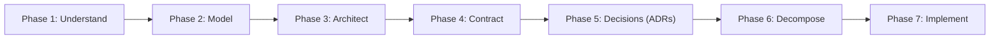

# Enterprise LLM Fine-Tuning & Serving Platform
## Architecture & Engineering Design Documentation (Phases 1 — 6)

Welcome to the enterprise engineering design documentation for the **Enterprise LLM Fine-Tuning & Serving Platform**. 

This documentation represents the **Pre-Implementation & Architecture Blueprint**, adhering strictly to enterprise-grade Software Engineering standards, Clean/Hexagonal Architecture, and Domain-Driven Design (DDD).

---

### The 7-Phase Engineering Lifecycle



---

### Directory Sitemap

```
docs/
├── README.md                                  <- Master Engineering Index & Architecture Guide
│
├── phase_1_understand/                        <- Phase 1: Problem Space & Requirements
│   └── 01_prd_and_problem_statement.md        <- Product Requirements Document (PRD), Goals, NFRs, Actors
│
├── phase_2_model/                             <- Phase 2: Domain & Conceptual Modeling
│   ├── 01_use_cases.md                        <- Atomic Use Cases (UC-01 to UC-06)
│   ├── 02_domain_model.md                     <- Ubiquitous Language & Domain Entity Model
│   └── 03_sequence_flows.md                   <- End-to-End Runtime Sequence Diagrams
│
├── phase_3_architect/                         <- Phase 3: System & Software Architecture
│   ├── 01_system_architecture_c4.md           <- C4 System Architecture (Context, Container, Component)
│   ├── 02_clean_hexagonal_architecture.md     <- Clean/Hexagonal Architecture & Boundary Rules
│   └── 03_external_integrations.md            <- Adapters for HuggingFace, S3, Prometheus, MLflow, vLLM
│
├── phase_4_contract/                          <- Phase 4: Interface-First Contracts & Schemas
│   ├── 01_domain_interfaces.md                <- Abstract Python Protocols & ABC Contracts
│   ├── 02_pydantic_schemas.md                 <- Pydantic v2 Immutable Configuration Schemas
│   └── 03_dtos_and_api_contracts.md           <- Data Transfer Objects (DTOs) & REST/CLI Contracts
│
├── phase_5_decisions/                         <- Phase 5: Architecture Decision Records (ADRs)
│   ├── README.md                              <- ADR Index & Governance Guidelines
│   ├── 0001-adoption-of-clean-hexagonal-architecture.md
│   ├── 0002-standardize-model-export-on-safetensors.md
│   ├── 0003-pydantic-v2-and-yaml-for-configuration-management.md
│   ├── 0004-qlora-and-bitsandbytes-for-vram-constrained-finetuning.md
│   └── 0005-asynchronous-vllm-engine-for-production-serving.md
│
└── phase_6_decompose/                         <- Phase 6: Work Breakdown Structure & Execution
    ├── 01_work_breakdown_structure.md         <- Parallel Work Tracks (Data, Model, Infra, DevOps)
    ├── 02_task_backlog_and_ownership.md       <- Jira/Linear Developer Task Tickets
    └── 03_dependency_graph_and_critical_path.md <- Task Dependencies & Milestone Schedule
```

---

### How Teams Use This Documentation

1. **New Engineers:** Read `phase_1_understand/` and `phase_2_model/` to understand the domain and business expectations.
2. **System Architects:** Review `phase_3_architect/` and `phase_5_decisions/` to understand component boundaries and trade-offs.
3. **Developers (Parallel Track):** Read `phase_4_contract/` and `phase_6_decompose/` to start writing adapter implementations and tests against fixed domain contracts without blocking colleagues.
