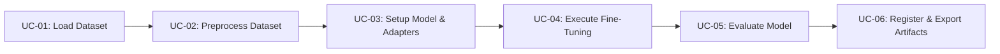

# Phase 2: Model
# Use Cases Specification

**Document Version:** 1.0.0  
**Status:** Approved  

---

## 1. Overview of Platform Use Cases

The application layer decomposes platform operations into six atomic, decoupled use cases:

---

## 2. Detailed Tabular Use Case Specifications

### UC-01: Ingest and Validate Dataset
* **Primary Actor:** `ML Engineer` / `Automated Pipeline`
* **Pre-conditions:** `DatasetConfig` is valid; network/storage credentials accessible.
* **Post-conditions:** Returns a validated `DatasetDict` containing required splits.

| Step | Action Description | System Response |
| :--- | :--- | :--- |
| 1 | Use case receives `DatasetConfig`. | Validates source type (`huggingface`, `s3`, `local`). |
| 2 | Queries `DatasetLoaderFactory` for matching adapter. | Instantiates appropriate `DataLoaderBase` concrete implementation. |
| 3 | Executes `loader.load_data(dataset_name)`. | Downloads/streams dataset from target source. |
| 4 | Validates presence of `train_split` and `eval_split`. | Verifies non-empty rows. |
| 5 | Returns validated `DatasetDict`. | Emits log: `[Dataset] Successfully loaded N samples`. |

* **Alternative Flow (Data Unreachable):** Throws `DatasetIngestionError` with actionable error diagnostics.

---

### UC-02: Preprocess & Format Training Dataset
* **Primary Actor:** `Preprocess Pipeline` / `Data Engineer`
* **Pre-conditions:** Raw `DatasetDict` loaded; `TokenizerBase` initialized.
* **Post-conditions:** Returns tokenized/formatted dataset with unified `"text"` or `"input_ids"` fields.

| Step | Action Description | System Response |
| :--- | :--- | :--- |
| 1 | Receives raw dataset, tokenizer, and template config. | Selects `PromptFormatter` strategy. |
| 2 | Calls `DatasetProcessor.process(dataset)`. | Applies chat template (`<|im_start|>...<|im_end|>`) in parallel batches. |
| 3 | Verifies formatting integrity. | Asserts no `None` or zero-length strings exist in processed splits. |
| 4 | Returns formatted dataset ready for Trainer. | Emits preprocessing summary and token length statistics. |

---

### UC-03: Configure Model Precision & LoRA Adapters
* **Primary Actor:** `Training Engine`
* **Pre-conditions:** Valid `LLMModelConfig` and `QuantizationConfig`.
* **Post-conditions:** Base model loaded in target precision (4-bit NF4 / 16-bit BF16) and wrapped with `PeftModel`.

| Step | Action Description | System Response |
| :--- | :--- | :--- |
| 1 | Resolves quantization config. | Builds `BitsAndBytesConfig` (4-bit NF4, double quant, bfloat16 compute). |
| 2 | Loads base model via `ModelLoaderBase`. | Downloads weights; enables gradient checkpointing; prepares k-bit training. |
| 3 | Builds `LoraConfig` from parameters. | Attaches LoRA adapter layers to target projection matrices (`q, k, v, o, gate, up, down`). |
| 4 | Calculates trainable vs. frozen parameters. | Emits memory estimate log: `Trainable params: 0.15% (18.4M / 7.2B)`. |

---

### UC-04: Execute Fine-Tuning Loop with Telemetry
* **Primary Actor:** `TrainPipelineUsecase`
* **Pre-conditions:** Prepared PEFT model, formatted dataset, initialized tokenizer, `MonitoringConfig`.
* **Post-conditions:** Model trained for specified epochs/steps; intermediate checkpoints saved.

| Step | Action Description | System Response |
| :--- | :--- | :--- |
| 1 | Builds `SFTConfig` / `TrainingArguments`. | Sets batch size, gradient accumulation, learning rate, and optimizer. |
| 2 | Attaches telemetry callbacks. | Registers `PrometheusLoggingCallback` (:8000) and `WandbCallback`. |
| 3 | Starts `trainer.train()`. | Executes forward/backward passes, gradient scaling, and periodic evaluations. |
| 4 | Broadcasts live metrics. | Exports loss, step latency, and GPU VRAM allocated to Prometheus & W&B. |
| 5 | Training completes successfully. | Saves final adapter weights to temporary artifact directory. |

---

### UC-05: Evaluate Fine-Tuned Model Benchmarks
* **Primary Actor:** `ML Engineer` / `CI Benchmark Runner`
* **Pre-conditions:** Fine-tuned checkpoint saved; evaluation dataset split available.
* **Post-conditions:** Returns structured evaluation scorecard (Perplexity, Loss, Task Metrics).

| Step | Action Description | System Response |
| :--- | :--- | :--- |
| 1 | Loads model with trained adapters. | Sets model to inference evaluation mode (`torch.no_grad()`). |
| 2 | Executes test split batch generation. | Generates model completions against reference prompts. |
| 3 | Computes task metrics. | Calculates Exact Match (EM), JSON Schema compliance rate, or ROUGE scores. |
| 4 | Exports evaluation report. | Publishes evaluation metrics to experiment tracker (W&B/MLflow). |

---

### UC-06: Export, Merge, and Register Model Artifacts
* **Primary Actor:** `MLOps Engineer` / `Release Pipeline`
* **Pre-conditions:** Successful training & evaluation completion; `ArtifactConfig` and `RegistryConfig`.
* **Post-conditions:** Merged model or adapter serialized in `safetensors` format and registered in Model Registry.

| Step | Action Description | System Response |
| :--- | :--- | :--- |
| 1 | Checks `save_merged_model` flag. | Merges LoRA delta weights back into base 16-bit weights if requested. |
| 2 | Serializes weights to disk. | Saves strictly as `.safetensors` alongside `tokenizer.json` and `chat_template.jinja`. |
| 3 | Validates artifact integrity. | Verifies safetensors header and sha256 checksums. |
| 4 | Publishes to Model Registry. | Uploads versioned model card and weights to Hugging Face Hub / MLflow / S3. |
