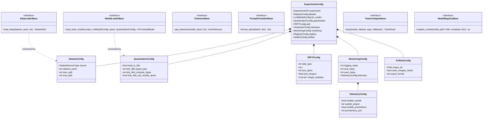

# Phase 2: Model
# Domain Model & Ubiquitous Language

**Document Version:** 1.0.0  
**Status:** Approved  

---

## 1. The Ubiquitous Language (Domain Glossary)

In Domain-Driven Design (DDD), a shared, unambiguous vocabulary between domain experts, ML engineers, and software architects is essential:

* **Experiment:** A distinct run consisting of a configuration specification, dataset, model, training strategy, and output artifacts.
* **Dataset Spec:** Metadata defining where training/eval data originates (source type, URI, split mappings).
* **Model Descriptor:** Specification of the base foundation model (Hugging Face ID or local path, architecture, context length).
* **Quantization Profile:** Precision configuration for loading model weights (4-bit NF4, double quant, 8-bit, 16-bit BF16).
* **Adapter / PEFT Policy:** Parameter-Efficient Fine-Tuning rules (LoRA rank $r$, scaling factor $\alpha$, target modules, dropout).
* **Prompt Template:** The structural syntax mapping raw user questions/answers into model-specific chat tokens (`<|im_start|>user\n...<|im_end|>`).
* **Artifact:** Immutable serialized model files saved strictly in `safetensors` format, containing weights, tokenizer, and generation configs.

---

## 2. Domain Concept Class Diagram

The following Mermaid diagram defines the core Domain Entities, Value Objects, and their relationships:

---

## 3. Aggregate Roots & Boundaries

1. **`ExperimentConfig` (Aggregate Root):** Immutable configuration validating the entire pipeline before execution begins.
2. **`DatasetAggregate`:** Encompasses raw splits, preprocessing transformations, and tokenized batches.
3. **`ModelAggregate`:** Encompasses the base model, quantization quantization states, and active PEFT adapter layers.
4. **`EvaluationScorecard`:** Encapsulates benchmark metrics, loss trajectories, and validation pass/fail assertions.
