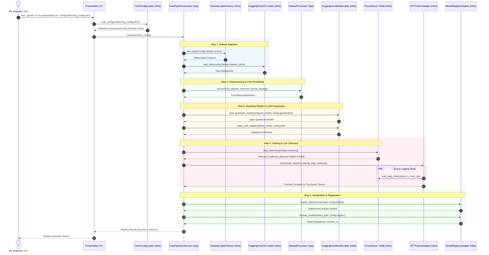
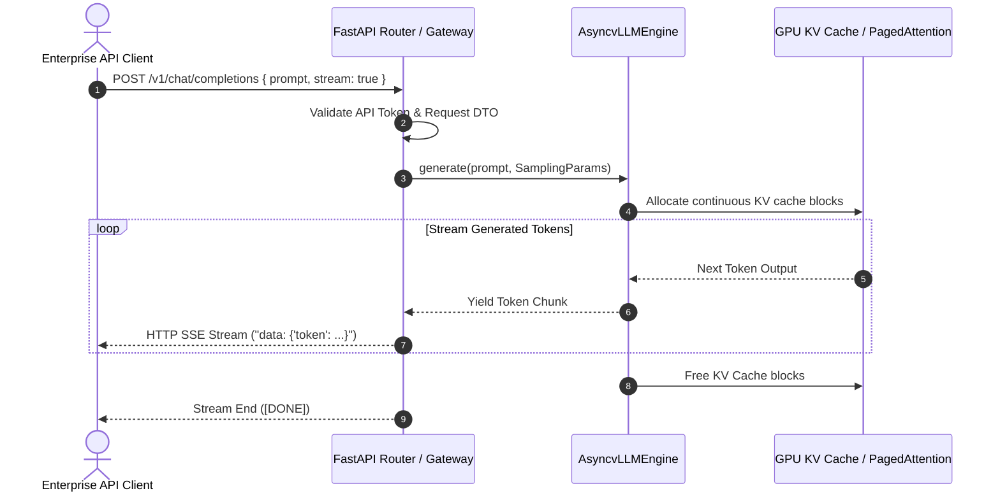

# Phase 2: Model
# End-to-End Sequence Flows

**Document Version:** 1.0.0  
**Status:** Approved  

---

## 1. Complete End-to-End Fine-Tuning Sequence

The following sequence diagram models the exact runtime interaction between CLI Presentation, Application Use Cases, Domain Interfaces, and Infrastructure Adapters:

---

## 2. Production Inference Serving Sequence (vLLM)

