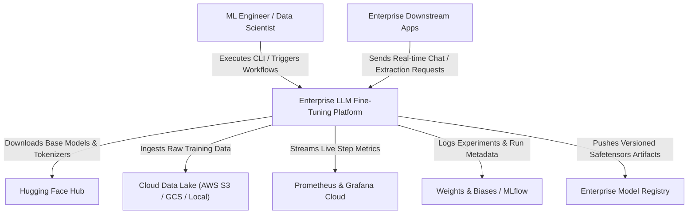
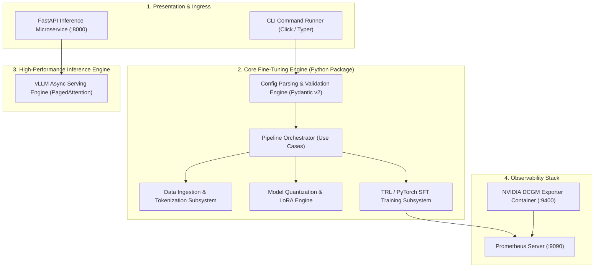
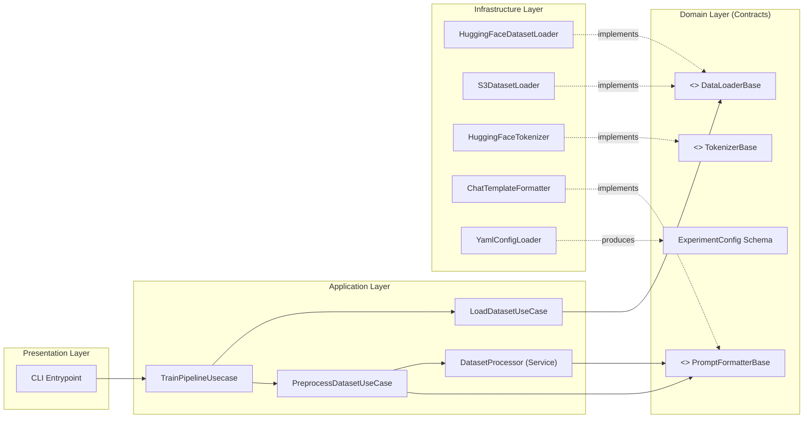

# Phase 3: Architect
# C4 System Architecture Model

**Document Version:** 1.0.0  
**Status:** Approved  

---

## 1. C4 Level 1: System Context Diagram

The System Context diagram illustrates the platform's relationship with external users, storage services, foundation model hubs, and observability backends:

---

## 2. C4 Level 2: Container Diagram

The Container diagram decomposes the platform into executable boundaries, services, and storage systems:

---

## 3. C4 Level 3: Component Diagram (Inside Core Engine)

