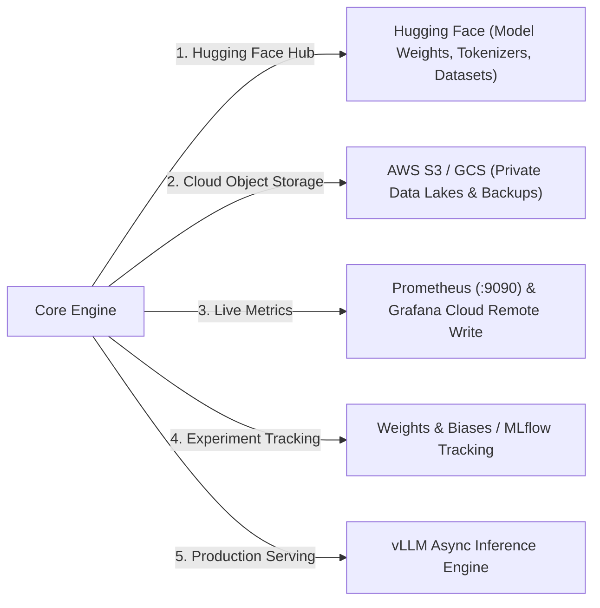

# Phase 3: Architect
# External Integrations Architecture

**Document Version:** 1.0.0  
**Status:** Approved  

---

## 1. External System Integration Matrix

The platform integrates with five external enterprise subsystems:



---

## 2. Integration Specifications

### 1. Hugging Face Hub Integration
* **Protocol:** HTTPS REST / `huggingface_hub` Python SDK.
* **Authentication:** Authenticates strictly via `HF_TOKEN` environment variable.
* **Resilience:** Automatic retry with exponential backoff on HTTP 429 / 503 rate limits.
* **Data Flow:** Downloads base weights (`safetensors`) and tokenizers to local cache directory (`~/.cache/huggingface/hub`).

---

### 2. Cloud Storage Integration (AWS S3 / GCS)
* **Protocol:** `boto3` / `google-cloud-storage` with S3 URI scheme (`s3://my-bucket/datasets/`).
* **Authentication:** IAM Instance Roles / AWS STS temporary credentials. Zero access keys in plaintext.
* **Supported Formats:** `.parquet`, `.jsonl`, `.csv`, `.safetensors`.

---

### 3. Observability & Prometheus Integration
* **Architecture:** In-process Prometheus Python client exposing metrics on port `8000`.
* **Scrape Configuration:**
  ```yaml
  scrape_configs:
    - job_name: 'qlora_training_app'
      static_configs:
        - targets: ['host.docker.internal:8000']
    - job_name: 'nvidia_dcgm_gpu'
      static_configs:
        - targets: ['dcgm-exporter:9400']
  ```
* **Remote Write:** Prometheus securely streams scraped time-series to Grafana Cloud over TLS using Basic Auth credentials injected via environment variables.

---

### 4. High-Throughput Serving Integration (vLLM)
* **Architecture:** `vLLM` AsyncLLMEngine running as a standalone ASGI / FastAPI service.
* **Capabilities:** PagedAttention for zero KV-cache memory waste, continuous batching for maximum GPU utilization, and OpenAI-compatible streaming endpoints (`/v1/chat/completions`).
