# Phase 6: Decompose
# Work Breakdown Structure (WBS)

**Document Version:** 1.0.0  
**Status:** Approved  

---

## 1. Work Breakdown Structure (WBS) by Tracks

To allow multiple developers to implement features concurrently without blocking one another, the project is decomposed into **5 independent engineering tracks**:

```mermaid
flowchart TD
    Root["Enterprise Fine-Tuning Platform"]
    
    Root --> T1["Track 1: Foundation & Domain Core"]
    Root --> T2["Track 2: Data Ingestion & Preprocessing"]
    Root --> T3["Track 3: Model, LoRA & Training Engine"]
    Root --> T4["Track 4: Observability, Eval & Registry"]
    Root --> T5["Track 5: Serving, CLI & DevOps/CI"]

    T1 --> T1_1["Schemas (Pydantic v2)"]
    T1 --> T1_2["Domain Interfaces (ABCs)"]
    T1 --> T1_3["Config Loaders (YAML/JSON)"]

    T2 --> T2_1["Hugging Face Loader"]
    T2 --> T2_2["S3 Data Lake Loader"]
    T2 --> T2_3["Chat Template Formatter"]
    T2 --> T2_4["DatasetProcessor Service"]

    T3 --> T3_1["BitsAndBytes 4-bit Loader"]
    T3 --> T3_2["PEFT / LoRA Adapter Wrapper"]
    T3 --> T3_3["TRL SFTTrainer Adapter"]
    T3 --> T3_4["TrainModelUseCase"]

    T4 --> T4_1["Prometheus Metrics Callback"]
    T4 --> T4_2["W&B / MLflow Callback"]
    T4 --> T4_3["Benchmark Evaluator"]
    T4 --> T4_4["Safetensors Model Registry"]

    T5 --> T5_1["Async vLLM Serving Microservice"]
    T5 --> T5_2["Presentation CLI (Typer)"]
    T5 --> T5_3["Dockerfiles & Docker Compose"]
    T5 --> T5_4["GitHub Actions CI/CD Gate"]
```

---

## 2. Track Descriptions & Outputs

| Track ID | Track Name | Primary Responsibilities | Target Artifacts |
| :--- | :--- | :--- | :--- |
| **Track 1** | **Foundation & Domain Core** | Define contracts, Pydantic validation schemas, and config loader. | `src/domain/schemas/`, `src/domain/interfaces/`, `src/infrastructure/config/` |
| **Track 2** | **Data Subsystem** | Build data ingestion adapters and chat-template tokenization services. | `src/infrastructure/huggingface/`, `src/infrastructure/s3/`, `src/application/services/` |
| **Track 3** | **Model & Training Engine** | Build 4-bit QLoRA loader, LoRA configurations, and SFT training loop. | `src/infrastructure/models/`, `src/application/usecases/train_pipeline.py` |
| **Track 4** | **Observability & Registry** | Implement Prometheus VRAM/loss exporter, W&B logger, and Safetensors registry. | `src/infrastructure/observability/`, `src/infrastructure/registry/` |
| **Track 5** | **Serving, CLI & CI/CD** | Expose vLLM streaming API, CLI runner, Docker images, and GitHub Actions. | `src/presentation/`, `Dockerfile`, `.github/workflows/ci.yml` |
