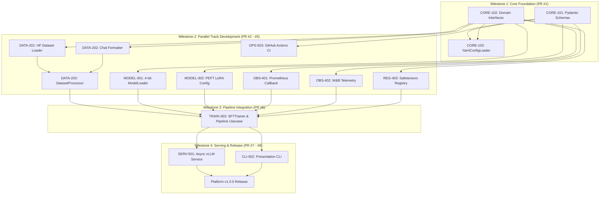

# Phase 6: Decompose
# Dependency Graph, Critical Path & Milestone Schedule

**Document Version:** 1.0.0  
**Status:** Approved  

---

## 1. Task Dependency Graph

The following Mermaid graph displays the exact prerequisites and dependencies between developer tasks:

---

## 2. Critical Path Analysis

The **Critical Path** (the longest sequence of dependent activities determining the minimum project duration) is:

$$\text{CORE-101/102} \longrightarrow \text{DATA-201/202} \longrightarrow \text{DATA-203} \longrightarrow \text{TRAIN-303} \longrightarrow \text{SERV-501} \longrightarrow \text{RELEASE}$$

* **Total Estimated Velocity:** 2 Sprints (4 weeks total for a 4-engineer team).
* **Risk Mitigation:** Developers on Track 4 (Observability) and Track 5 (CI/CD) run 100% in parallel without blocking the critical path.
